# Secure Document Vault System 🔐

A full-stack secure web application for managing encrypted documents with modern authentication mechanisms, built as a final project for the **Data Integrity and Authentication** course.

[](https://nodejs.org)
[](https://vitejs.dev)
[](https://postgresql.org)
[](LICENSE)

---

## 📸 Screenshots

### Register & Password Policy
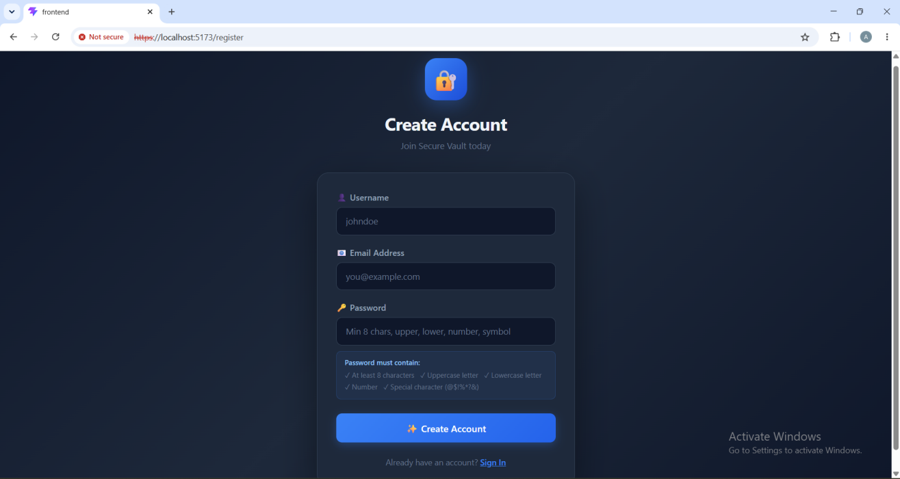
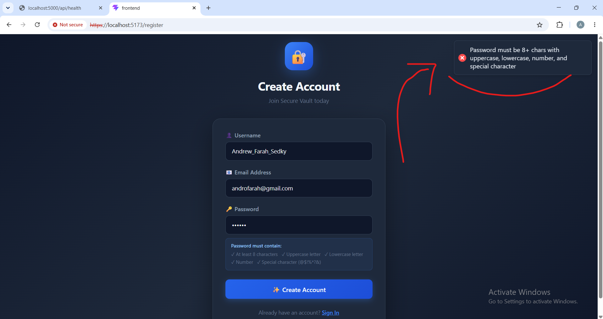

### Login & Dashboard & JWT Token
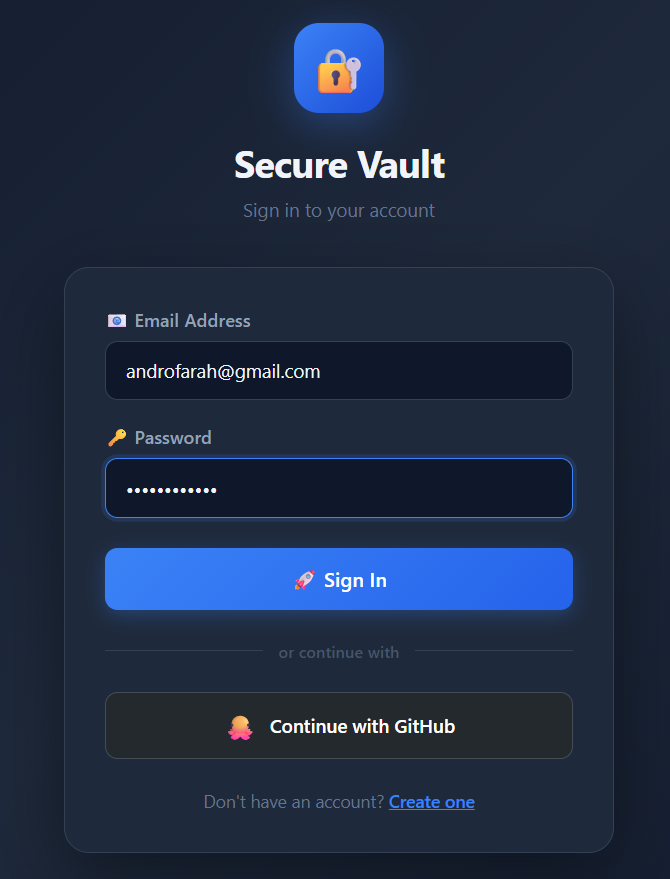
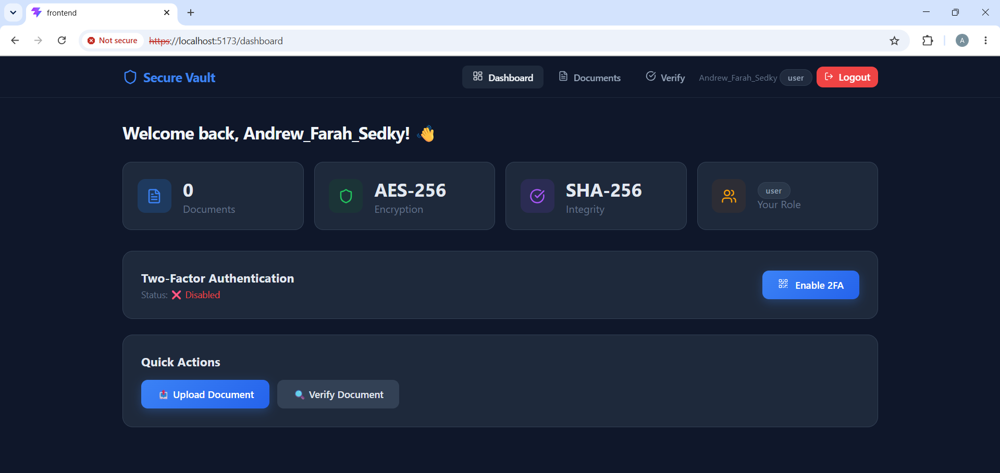
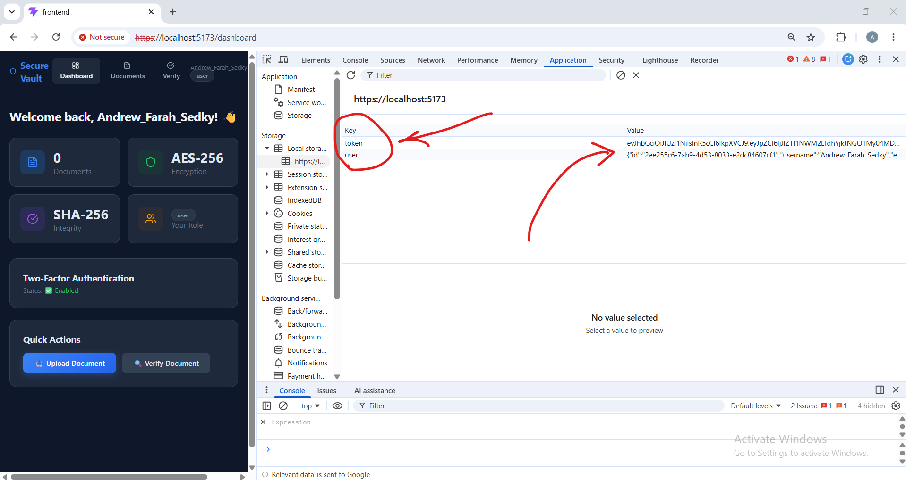

### GitHub OAuth
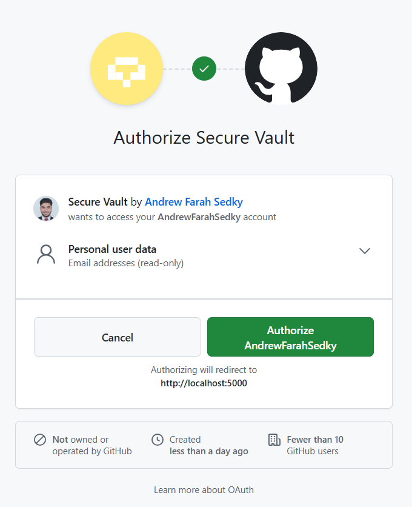

### Two-Factor Authentication (2FA)
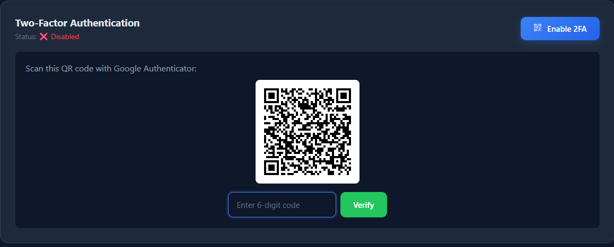

### Admin Panel (RBAC)
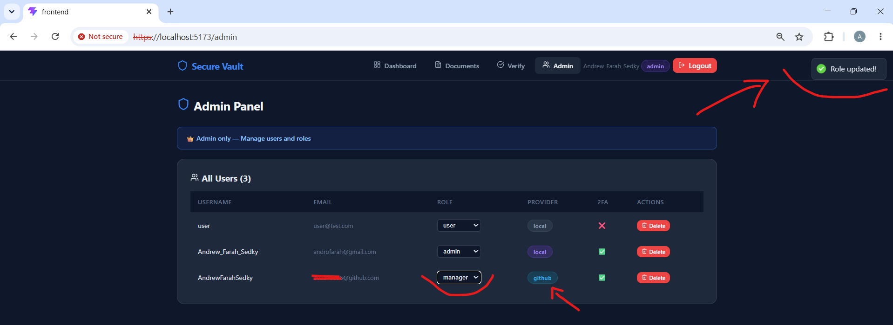

### Document Management & Encryption
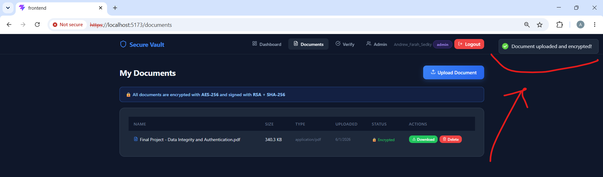
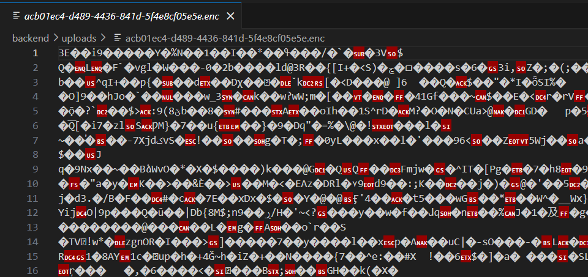

### Integrity Verification
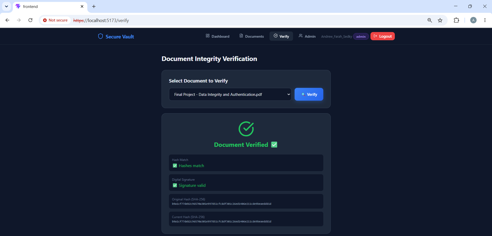

### Wireshark — HTTP vs HTTPS
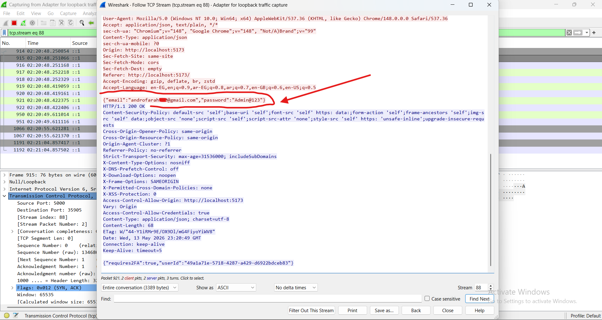
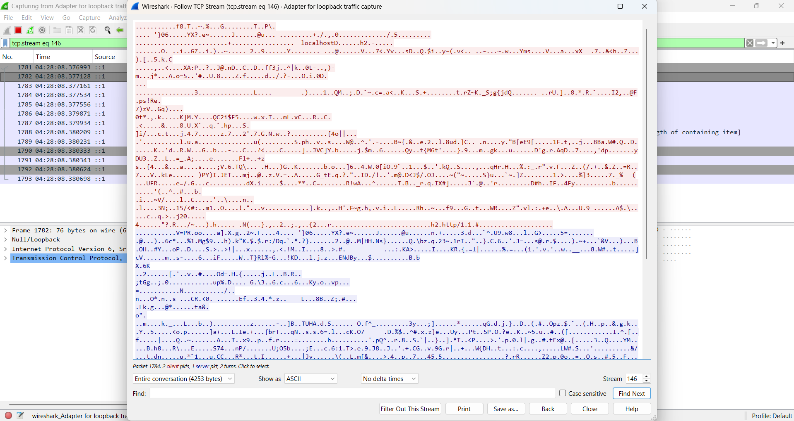

---

## ✅ Security Features

- 🔑 JWT Authentication & Authorization
- 🔒 Password Hashing with bcrypt (cost factor 12)
- 📋 Password Policy Enforcement
- 🐙 OAuth 2.0 Login via GitHub
- 📱 Two-Factor Authentication (TOTP + Google Authenticator)
- 👥 Role-Based Access Control (Admin / Manager / User)
- 🛡️ Document Encryption — AES-256-CBC
- ✍️ Digital Signatures — RSA-2048
- 🔍 Integrity Verification — SHA-256
- 🌐 HTTPS with SSL/TLS Certificates
- 🦈 MITM Traffic Analysis using Wireshark

---

## 🛠️ Tech Stack

| Layer | Technology |
|-------|-----------|
| Backend | Node.js + Express.js |
| Frontend | React.js + Vite |
| Database | PostgreSQL + Sequelize |
| Authentication | JWT + Passport.js |
| Encryption | AES-256-CBC + RSA-2048 |
| Password Hashing | bcryptjs |
| 2FA | Speakeasy + Google Authenticator |
| HTTPS | Self-signed SSL (mkcert) |

---

## 🚀 How to Run

### Prerequisites
- Node.js v20+
- PostgreSQL v15+
- Git

### 1. Clone the repository
```bash
git clone https://github.com/AndrewFarahSedky/Secure-Document-Vault-System.git
cd Secure-Document-Vault-System
```

### 2. Setup Database
- Open pgAdmin
- Create a database named `secure_vault`
- Run `database/schema.sql` in the Query Tool

### 3. Setup Backend
```bash
cd backend
npm install
```

Create a `.env` file in the `backend` folder:
```env
PORT=5000
DB_HOST=localhost
DB_PORT=5432
DB_NAME=secure_vault
DB_USER=postgres
DB_PASSWORD=your_postgres_password

JWT_SECRET=your_jwt_secret_key
JWT_EXPIRES_IN=24h

GITHUB_CLIENT_ID=your_github_client_id
GITHUB_CLIENT_SECRET=your_github_client_secret
GITHUB_CALLBACK_URL=https://localhost:5000/api/auth/github/callback

ENCRYPTION_KEY=12345678901234567890123456789012
FRONTEND_URL=https://localhost:5173
```

```bash
npm run dev
```

### 4. Setup Frontend
```bash
cd frontend
npm install
npm run dev
```

---

## 🌐 Access

| Service | URL |
|---------|-----|
| Backend API | https://localhost:5000/api/health |
| Frontend | https://localhost:5173 |

---

## 👑 Default Admin Setup

After registering, run this SQL in pgAdmin to grant admin access:

```sql
UPDATE users SET role = 'admin' WHERE email = 'your_email@example.com';
```

---

## 📄 Project Report

The full project report is available in the [`docs/`](docs/) folder.

---

## 🎓 Course Info

**Data Integrity and Authentication** — Spring 2026
Faculty of Computers and Data Science — Cyber Security
Alexandria National University